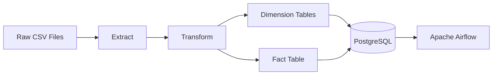
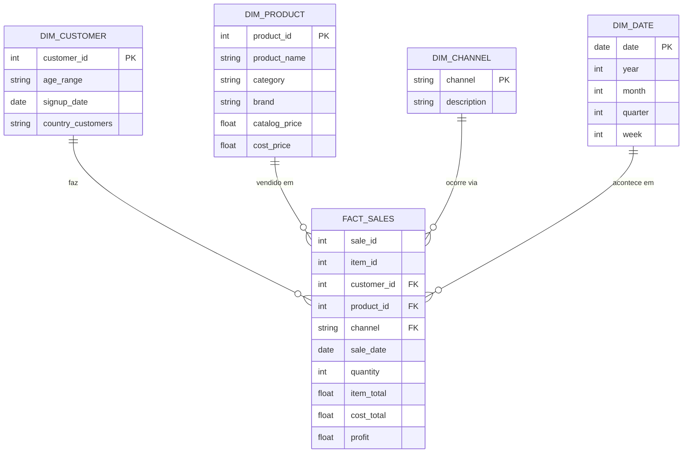
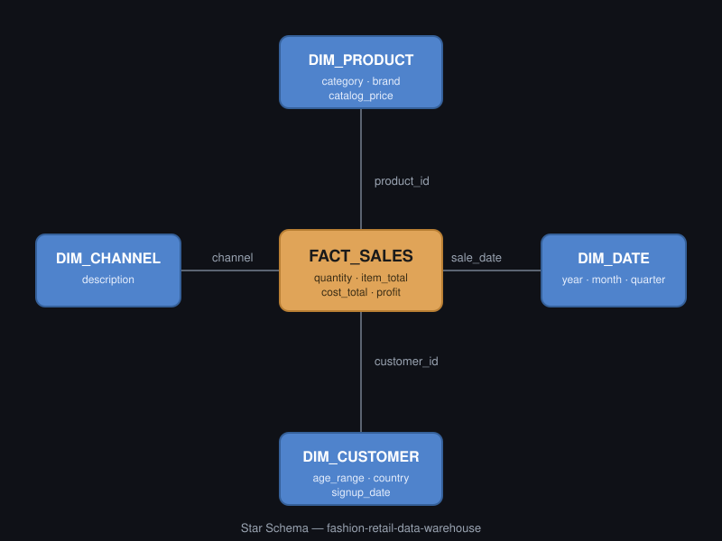
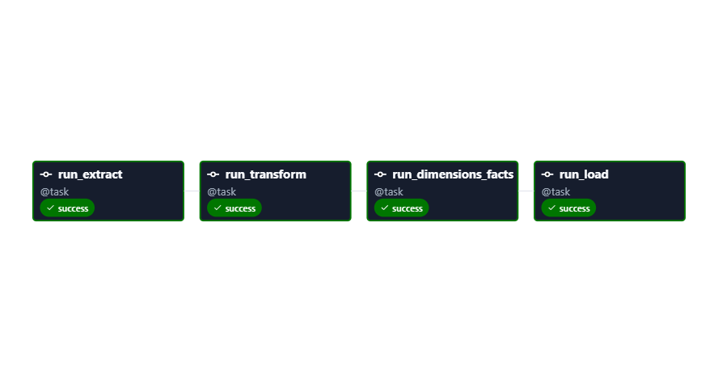
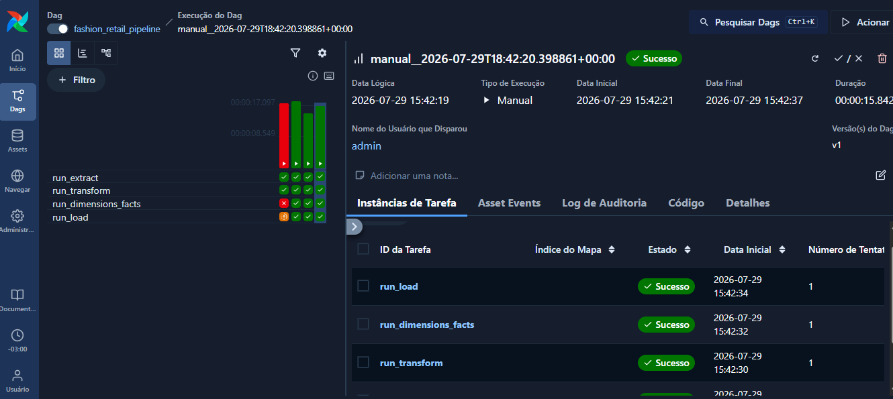

# Fashion Retail Data Warehouse with Apache Airflow

End-to-end Data Engineering project that builds a Data Warehouse for a fashion retail company using a dimensional model (Star Schema), ETL pipelines in Python, SQL reporting, and workflow orchestration with Apache Airflow.

---

## Project Overview

This project demonstrates the complete lifecycle of a modern data engineering solution:

- Extract data from multiple CSV files.
- Transform and clean datasets using Python and Pandas.
- Build dimension and fact tables.
- Load the processed data into a PostgreSQL Data Warehouse.
- Orchestrate the ETL pipeline using Apache Airflow.
- Generate analytical SQL reports for business insights.

The objective is to simulate a real-world retail analytics environment while applying data engineering best practices.

---

## Tech Stack

- Python 3.12
- Pandas
- PostgreSQL
- Apache Airflow
- SQL
- Mermaid
- Git & GitHub

---

## Project Structure

```text
fashion-retail-data-warehouse/
│
├── airflow_home/
│   └── dags/
│
├── data/
│   └── raw/
│
├── docs/
│
├── sql/
│   └── reports.sql
│
├── src/
│   ├── database.py
│   ├── extract.py
│   ├── transform.py
│   └── load.py
│
├── warehouse/
│   ├── dimensions.py
│   └── facts.py
│
├── README.md
└── requirements.txt
```

---

# Architecture




---

# Star Schema

```markdown

```

---

# Apache Airflow DAG

The ETL pipeline is orchestrated using Apache Airflow.

Pipeline tasks:

1. Extract Data
2. Transform Data
3. Dimensions and fact
4. Load Data

---

# Airflow Execution


```markdown

```
```markdown

```

---


# Data Warehouse Model

The dimensional model consists of:

### Dimensions

- dim_customer
- dim_product
- dim_channel
- dim_date

### Fact

- fact_sales

This structure enables fast analytical queries while reducing redundancy.


---

# Future Improvements

- Docker support
- Automated testing
- BI dashboard integration
- Incremental loading
- Logging improvements
- CI/CD with GitHub Actions
- Cloud deployment (AWS)

---

# Learning Outcomes

This project demonstrates practical experience with:

- ETL development
- Data Warehousing
- Star Schema modeling
- PostgreSQL
- Apache Airflow
- SQL Analytics
- Python for Data Engineering
- Workflow orchestration
- Git version control

---

## Dataset

This project uses the **European Fashion Store Multi-Table Dataset** available on Kaggle.

**Source:**
https://www.kaggle.com/datasets/joycemara/european-fashion-store-multitable-dataset

The dataset simulates transactions from an online fashion retailer and includes information about customers, products, orders, channels and inventory. It was adapted for building a dimensional model, ETL pipeline and analytical warehouse.